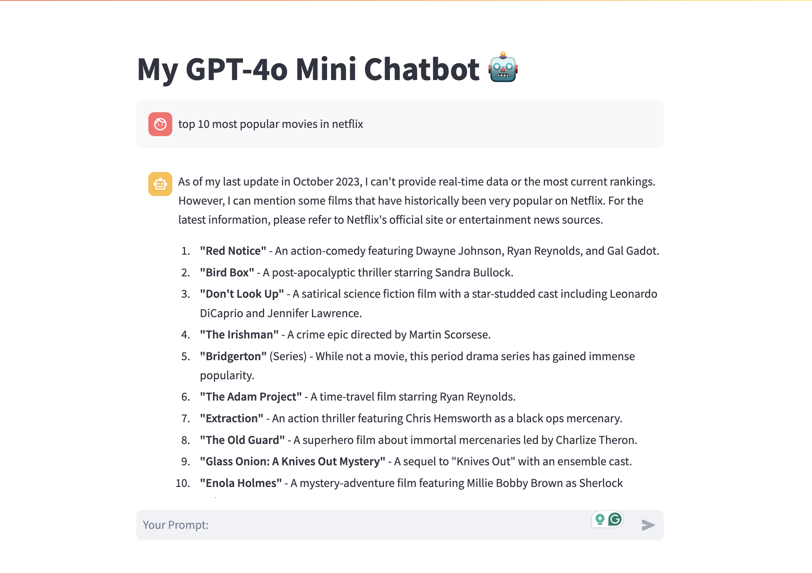

# OpenAI API ChatBot GPT-4o with Streamlit

## Project Overview:

### Building the ChatBot

Step-by-Step Process:
Install necessary libraries (openai, streamlit).
Authenticate with OpenAI using an API key.
Write a function to make API requests to GPT-4o.
Code Example:
Provide a basic example of Python code that communicates with the GPT-4 API.

### Streamlit Integration

Integration Steps:
Install Streamlit.
Set up the chatbot interface with Streamlit widgets (text input, submit button).
Display chatbot responses in real-time.
Code Example:
Provide a simple example of how to set up a chatbot interface using Streamlit.

## Preparing the project:

Step 1: Prepare the Python Environment. 1. Create the project folder. 2. Prepare the Python environment. 3. Create the OpenAI API key. 4. Load the OpenAI API key.

Step 2: Install the necessary packages.

    OpenAI API: openai — the library to use OpenAI models via API calls.
    Streamlit: streamlit — to create a User Interface for the chatbot.
    Python Dotenv: python-dotenv — to load secret variables from the .env file.
    Tiktoken: tiktoken — for counting tokens.

## Screenshot of execution results:

